# 뒤틀린 과자 동화 개편 계획 (TwistedCandyPlan)

- 작성: 2026-10-07 · 상태: **📝 계획 — V0 결정 완료(2026-10-07, §8)**, V5 소리는 캔디숲 견본 청취 중. 맵은 아직 바꾸지 않았다.
- 범위: ① 맵 5개 + **로비·대기실** 분위기·소품 ② 숨을 곳(들어갈 수 있는 공간) ③ 색칠 위장 팔레트 ④ 배경음·효과음 다시 만들기
- 이 문서가 개편 작업의 **유일한 계획서**다. 소리 구조(코드·카탈로그)는 `SoundPlan.md`, 음원 ID 명세는 `SoundReplacementList.md`를 그대로 쓴다.
- 표시: ⬜ 대기 · 🔄 진행 중 · ✅ 완료

---

## 0. 왜 바꾸나

| 요소 | 지금 | 문제 |
|---|---|---|
| 괴물 | 무섭게 생김, 촉수·잡기·처형 | — |
| 추격음(확정 D) | 타이코 북 질주 + 어두운 현악 | 진지한 공포·전투 톤 |
| 맵 5개 | 밝은 분홍·파스텔, 장난감 같은 과자 | **너무 귀엽고 유아틱** — 괴물·추격음과 따로 논다 |
| 효과음·배경음(S8) | "귀여운 위 + 낮은 아래" | 맵과 같은 이유로 유아틱 |
| 숨을 곳 | 트인 공간 위주 | 괴물이 다가와도 피할 곳이 부족 |

시계탑 아래 지하 유적만 톤이 맞는다 — 어둡고 낡았기 때문이다. 개편은 **맵 전체를 그 방향으로** 맞추는 일이다.

---

## 1. 컨셉 — 뒤틀린 과자 동화 (Corrupted Candyland)

> **"귀여웠던 것이 망가진 곳."** 과자·사탕·놀이공원이라는 재료는 그대로 두고, 버려지고 썩고 고장 난 모습으로 바꾼다.

### 1.1 원칙
| # | 원칙 | 예 |
|---|---|---|
| C1 | **귀여움은 재료, 망가짐이 주제** | 회전목마 말 → 머리 없는 말, 진저브레드 인형 → 팔이 부서진 인형 |
| C2 | **그로테스크는 "망가진 장난감"까지** (사용자 결정 2026-10-07) | 아래 1.2 기준표 |
| C3 | **바탕은 빛바래고 어둡게, 숨을 색은 남긴다** | 색칠 위장이 게임의 핵심 — §4 |
| C4 | **맵마다 망가진 정도가 다르다** | 캔디숲(겉은 아직 예쁨) → 놀이공원(완전히 망가짐), §2 표의 강도 |
| C5 | **어두워도 길은 보인다** | 바닥·길·출구는 읽히게(밝은 쪽 조명·발광 표지), 괴물 실루엣은 보이게 |

### 1.2 그로테스크 기준표
| 허용 ✅ | 금지 ❌ |
|---|---|
| 머리·팔이 떨어진 장난감·인형(속은 비어 있거나 과자 단면·솜·부스러기) | 피·살·내장·뼈 |
| 사탕·과자 속 눈알(만화식, 붉은 홍채), 웃는 얼굴의 금 | 사람·동물의 실제 상처 |
| 녹아 흘러내리는 사탕·초콜릿, 곰팡이 핀 크림 | 고통스러운 표정의 실제 사람 형상 |
| 줄에 매달린 젤리 곰·인형(축 늘어진 모습) | 목매달기 연상(올가미·사람 크기) — **매달 때는 다리·몸통 끈으로** |
| 거미줄 같은 실사탕, 깨진 유리 사탕 | 신체 훼손 묘사 문구 |

### 1.3 대표 소품 예시 (Blender 목업 — 최종 품질 아님, 방향 확인용)
| 머리 없는 회전목마 유니콘 | 녹아내리는 눈알 막대사탕 | 팔이 부서진 진저브레드 인형 |
|---|---|---|
| 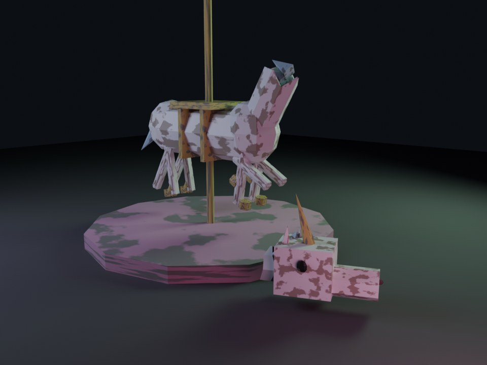 | 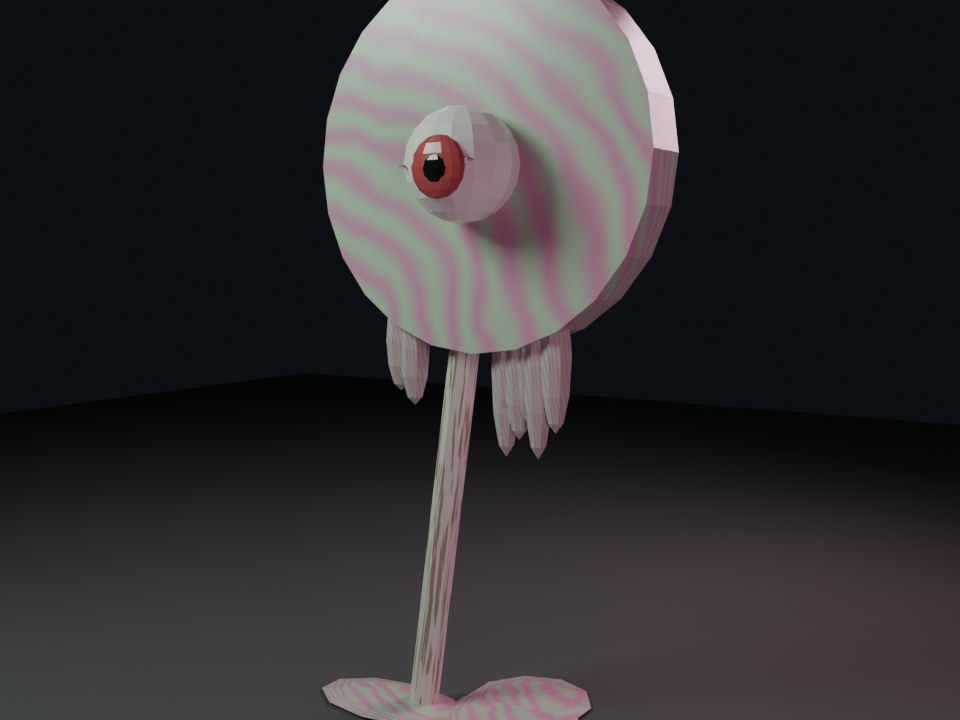 | 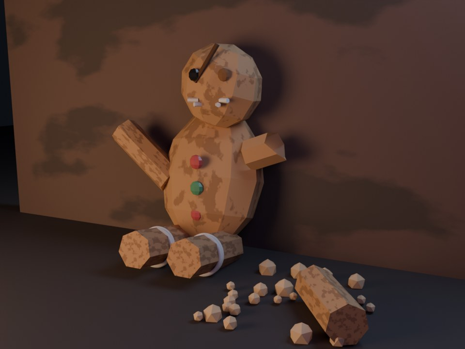 |
| 칠이 벗겨진 말이 기둥에 매달려 돌고, 뿔 달린 머리는 받침대 밑에 굴러 있다(목 단면은 속이 빈 플라스틱) | 막대사탕 한가운데 붉은 눈이 플레이어를 본다, 아래로 녹아 바닥에 고인다 | 팔이 떨어져 부스러기와 함께 바닥에, 단추 눈 하나는 빠지고 얼굴에 금 |

---

## 2. 맵별 계획

강도: ★ 약간 섬뜩(겉은 예쁨) · ★★ 낡고 불안 · ★★★ 완전히 망가짐

### 2.1 분위기(조명·안개·색 보정) — 지금 / 개편 예시
실제 게임 화면에서 조명·안개·색 보정만 임시로 바꿔 찍었다(씬은 저장하지 않음). 소품을 바꾸기 전이라 **원래 밤인 맵은 차이가 작다** — 그 맵들은 소품·고장 난 조명이 더 중요하다.

| 맵 | 지금(왼쪽) → 개편 예시(오른쪽) |
|---|---|
| 캔디숲 | 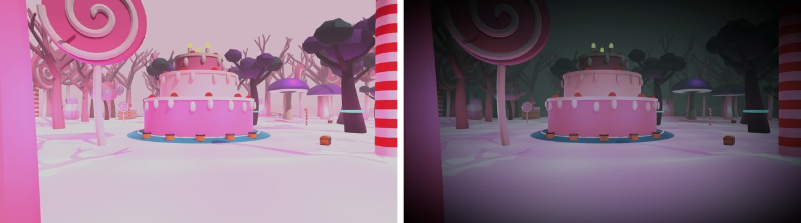 |
| 진저브레드 마을 | 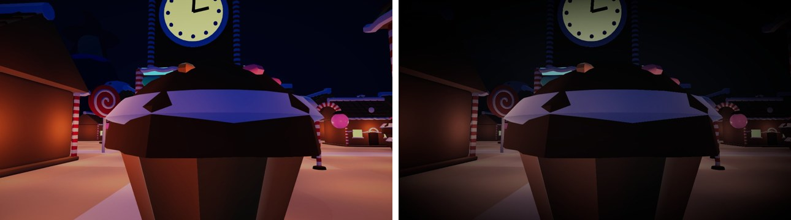 |
| 초콜릿 공장 | 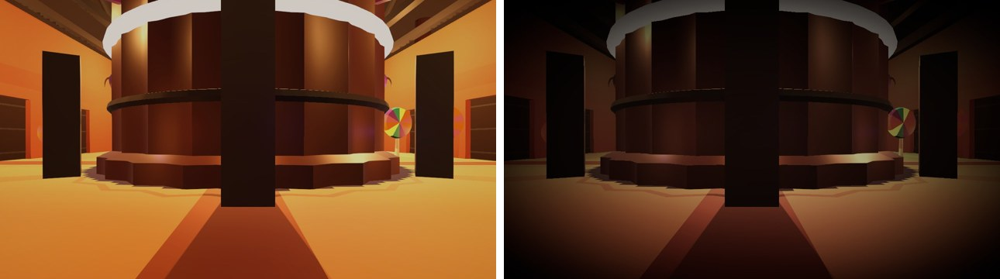 |
| 저주받은 놀이공원 | 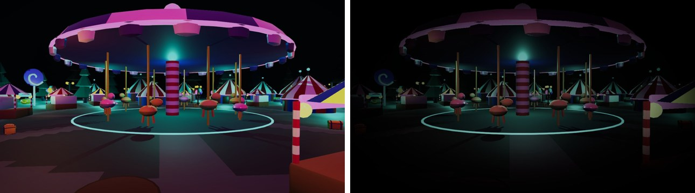 |
| 유령 베이커리 | 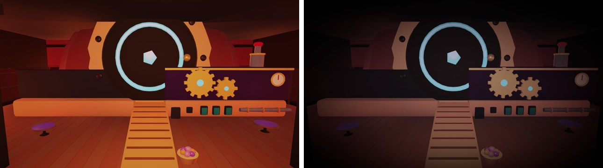 |

### 2.2 맵별 개편 내용
| 맵 | 강도 | 분위기 | 대표 망가진 소품 | 숨을 곳(새로) |
|---|---|---|---|---|
| **캔디숲** | ★ | 분홍 하늘 → 탁한 회녹색 안개 속 해 질 녘, 채도 −35, 나무는 앙상하게 | 눈알 막대사탕, 머리 없는 유니콘 동상(숲 입구), 녹아내린 사탕 나무, 곰팡이 핀 케이크(가운데 장치 케이크는 금이 간 채) | 쓰러진 거대 케이크 속 동굴(입구 2), 속이 빈 사탕 통나무 |
| **진저브레드 마을** | ★★ | 밤 → 차가운 푸른 안개, 창문 불빛 몇 개만 깜빡임, 네온 더 줄이기 | 팔 부서진 진저브레드 인형, 눈이 빠진 진저브레드 문지기, 멈춘 시계탑(바늘 하나 떨어짐) | **집 2~3채 안으로 들어가기**(문·뒷문·창문), 지하 유적은 지금 그대로 |
| **초콜릿 공장** | ★★ | 주황 → 갈색 매연, 증기·흐린 빛 | 녹아 늘어진 초콜릿 인형 틀, 컨베이어에 줄지어 선 얼굴 없는 쿠키 반죽, 망가진 포장 기계 | 기계 사이 통로, 창고 칸(선반 사이), 큰 초콜릿 탱크 뒤 |
| **저주받은 놀이공원** | ★★★ | 형광 네온 → 꺼지거나 깜빡이는 전구, 병든 녹색, 안개 | **머리 없는 회전목마 말들**, 찢어진 광대 얼굴 간판, 웃음이 굳은 인형 매표원, 바람 빠진 풍선 | **찢어진 서커스 텐트**(출구 2), 귀신의 집(짧은 미로), 매표소 |
| **로비**(Q4 — 함께 바꿈) | ★ | 밝은 쿠키 마을 그림 → 해 질 녘의 같은 마을, 멀리 마녀 과자집 실루엣과 괴물 그림자 | 배경 그림 다시 그리기(망가지기 시작한 표지판·꺼진 등불), UI 색은 읽히게 유지 | — (메뉴 화면) |
| **대기실**(마녀 과자집 앞, Q4) | ★★ | 이미 어두운 편 → 가마솥 빛만 강하게, 안개 | 과자집 벽의 눈알 사탕, 매달린 젤리 곰, 금 간 쿠키 울타리 | — (대기 공간) |
| **유령 베이커리** | ★★ | 따뜻한 빨강·주황 → 차가운 유령빛 + 오븐만 붉게 | 금 간 웨딩 케이크(인형 하나만 남음), 유리병 속 떠다니는 쿠키 인형, 밀가루 발자국 | 반죽 창고, 진열장 뒤, 큰 밀가루 포대 더미 |

### 2.3 숨을 곳 설계 규칙
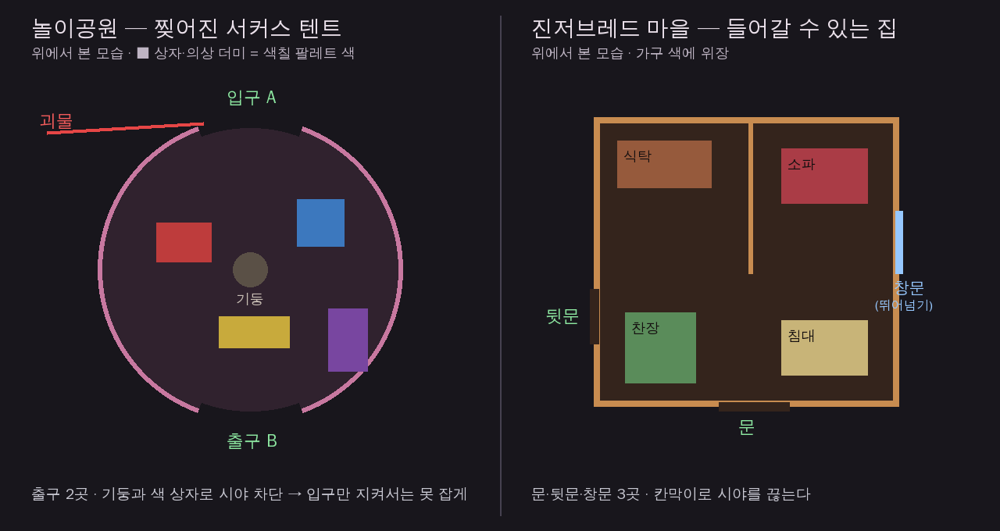

| 규칙 | 이유 |
|---|---|
| **출입구 2곳 이상** | 입구 하나면 괴물이 지키기만 해도 잡힌다(막다른 함정 금지) |
| 괴물도 들어갈 수 있는 크기(괴물 몸 크기 기준 문 폭·천장 높이) | 숨은 쿠키를 영원히 못 잡는 곳 금지 |
| 안에 **시야를 끊는 칸막이·기둥** + **팔레트 색 가구** | 숨기 = 색칠 위장 + 시야 차단 |
| 실내는 조금 어둡지만 출구 표시는 보이게 | C5 |
| 맵당 2~3곳, 탈출 장치·상자와 가깝지 않게 | 한 곳에 몰리지 않게 |
| 실내에서는 바깥 소리가 먹먹하게(§5.4) | 벽 너머 괴물 발소리로 긴장 |

---

## 3. 만드는 방법(기술)

| 대상 | 방법 | 비고 |
|---|---|---|
| 조명·안개·색 보정 | 맵마다 PostProcess 프로필 에셋 새로(`03. SO`가 아니라 기존 프로필 위치), `RenderSettings` 안개·주변광, 방향광 | 가장 싸고 효과 큼 — **1단계로 먼저** |
| 망가진 소품 | Blender 스크립트(`Assets/Maps/Source~/Scripts/twisted_props.py`, assets.py 도구 사용) → FBX → 자동 배치(§10 V3) | 게임과 같은 로우폴리·평면 셰이딩 |
| 숨을 곳 구조 | ~~맵 빌더 스크립트에 실내 공간 추가~~ → `twisted_props.py` 숨을 곳 단위 + 배치 도구가 장식 건물 자리를 바꿈(§10 V4) | 맵 재생성 시 손으로 고친 것이 덮이지 않게 **스크립트로만** 고친다 |
| 고장 난 조명 | 깜빡이는 전구 컴포넌트(이미 진저브레드 등불이 같은 방식) | 로컬 연출, 네트워크 없음 |
| 실내 소리 | §5.4 | |

---

## 4. 색칠 위장 팔레트 (가장 중요한 게임 조건)

- 지금 색칠 팔레트는 10색(빨강·주황·노랑·연두·초록·청록·파랑·남색·보라·자주)이다. 맵이 어두워지고 채도가 빠지면 **쿠키가 섞일 색이 사라진다**.
- 규칙: **맵마다 팔레트 10색 중 최소 6색이 큰 면적(벽·가구·소품)으로 남아 있어야 한다.** 바탕은 빛바래도, 숨을 소품은 팔레트 색 그대로 둔다(그림의 텐트 안 색 상자·집 안 가구).
- 색 보정(채도 −)은 팔레트 색도 함께 빼므로, **보정 후 화면에서 팔레트 색과 맵 표면 색의 차이**를 측정해 맞춘다(같은 색이 같게 보여야 위장이 된다). 필요하면 팔레트 색 자체를 "빛바랜 버전"으로 바꾼다(결정 필요 Q3).
- 검증: 맵마다 팔레트 색별로 화면 안 같은 색 면적 비율 측정(스크린샷 자동 분석), 오프라인 위장 시험(쿠키 색칠 후 거리별로 보이는지).

---

## 5. 배경음·효과음 개편

### 5.1 새 소리 정체성
| 이전(S8) | 새 방향 |
|---|---|
| 귀여운 위(마림바·셀레스타) + 낮은 아래 | **망가진 동화 소리** — 귀여운 악기를 쓰되 *고장 나고 늘어지고 틀어진* 상태로 |
| 밝은 장조 위주 | 단조·온음 음계, 음정이 미세하게 틀어진(디튠) 오르골·셀레스타, 느려지는 테이프 |
| 장난감 같은 음정 레이어 | 음정 레이어는 줄이고 **질감 위주**(바삭·끈적·삐걱·바람) |
| 추격음 D와 따로 놂 | **추격음 D(확정)와 같은 무게** — 평소엔 조용하고 불안, 괴물이 오면 북이 몰아친다 |

모티프 3개는 유지하되 바꾼다: 쿠키 모티프 → 단조·느리게(희망은 탈출 성공 때만 장조로), 괴물 모티프(B♭→A)는 그대로(추격음 금관 경고와 같은 반음), 마법 서명 → 역재생 종을 더 길고 어둡게.

### 5.2 바꿀 것 / 둘 것
| 묶음 | 개수 | 처리 |
|---|---|---|
| 맵 배경음(…Paint) 5 + 대기실(GameLobby) + 괴물 대기 | 7 | **다시 만들기** — 고장 난 오르골·느린 단조·빈 공간 울림. 맵 강도(★)에 맞춰 캔디숲은 아직 선율이 남고 놀이공원은 거의 부서진 소리 |
| 맵 환경음 4 + 동굴 + 공장 기계 + 회전목마 | 7 | **다시 만들기** — 새소리·풍경 제거 → 버려진 놀이기구 삐걱, 멀리 꺼져 가는 음악, 끈적한 소리, 바람. 회전목마는 늘어지고 끊기는 오르간 |
| 스팅어 5 · 징글 3 | 8 | **다시 만들기**(괴물 공개·합류는 더 무겁게, 탈출 성공만 밝게) |
| 쿠키 동작(발소리·점프 등) | 11 | **다듬기** — 마림바 음정 레이어 빼고 바삭·나무 질감만 |
| 괴물 소리 | 6 | **그대로**(이미 무겁고 질척, 톤이 맞음) |
| 마법·연출(포탈·제단·오븐 등) | 25 | **일부 다듬기** — 마법 서명이 들어간 것만 어둡게 |
| UI 15 · 도구 7 · 탈출 동작 | 약 35 | **대부분 그대로**(정보 전달용) — UI만 장난감 음색을 줄임 |
| 로비 곡 `Lobby`(확정) · 추격음 D(확정) | — | **그대로**(로비는 바깥 세계 — 대비가 된다. 바꿀지 Q5) |

- 제작은 S8과 같은 스크립트(`Source~/final/scripts/`)에 값과 재료만 바꿔서 다시 뽑는다. **이번에는 견본 관문을 둔다**: 맵 1개(캔디숲) 분위기 견본(배경음 30초 + 환경음 + 대표 효과음)을 먼저 들어 보고 방향 승인 → 나머지.

### 5.3 기술 조건
- Sound ID·재생 시점·길이·반복·2D/3D·거리는 `SoundReplacementList.md` 그대로(코드 변경 없음).
- 음량 계층·LUFS 기준은 S9 믹스 결과를 유지(배경음 −26, 바탕 환경음 −36 등) — 더 어두운 분위기에 맞게 **바탕 환경음은 조금 크게(−33 근처)** 검토.

### 5.4 실내 소리(새 기능, 작은 코드)
- 숨을 곳 안에서는 바깥 소리(바탕 환경음·멀리 있는 소리)를 먹먹하게(저역 통과) — 기존 `AmbientZone`(영역 안 2D 소리·배경음 낮춤)과 거리 감쇠(L3 저역 통과)를 재사용해 "실내 영역" 하나를 더한다.
- 괴물이 같은 실내에 들어오면 먹먹함이 풀린다(같은 영역 안 판정).

---

## 6. 단계

| 단계 | 내용 | 결과물·검증 | 상태 |
|---|---|---|---|
| **V0 결정** | §8 질문 답, 강도·숨을 곳 위치 확정 | 이 문서 갱신 | ✅ 2026-10-07 (Q3 보류) |
| **V1 분위기** | 맵 5개 조명·안개·색 보정 프로필(§2.1 예시를 다듬어 확정), 고장 난 조명 깜빡임 | 맵별 스크린샷 전후, 팔레트 색 차이 측정(§4), 프레임 확인 | ✅ 2026-10-07 (§10) |
| **V2 위장 팔레트** | 맵별 팔레트 6색 이상 면적 확보, 필요 시 팔레트 색 조정 | 색 면적 측정 + 오프라인 위장 시험 | ✅ 2026-10-07 측정(§10) — Q3 보류 유지, 부족한 색은 V3·V4 소품으로 채움 |
| **V3 망가진 소품** | 맵당 대표 소품 3~5종(§2.2) Blender 제작·배치 | 소품 렌더 + 맵 스크린샷, 충돌·길 막힘 없음(MapCompactTests) | ✅ 2026-10-07 (§10) |
| **V4 숨을 곳** | 맵당 2~3곳 실내 공간(§2.3 규칙), 실내 소리 | 쿠키·괴물 출입, 출구 2곳, 위장 시험, 테스트 통과 | ✅ 2026-10-07 (§10) — Q2대로 놀이공원 텐트 2 + 진저브레드 집 2 |
| **V5 소리** | 캔디숲 견본 → 승인 → 나머지(§5.2) | 견본 청취, 길이·LUFS·이음매 수치, Play Mode 재생 기록 | 🔄 캔디숲 견본 제작(§9) |
| **V6 마무리** | 멀티 확인, 빌드 확인, 문서 정리 | 빌드 한 판, 콘솔 0 | ⬜ |

순서 이유: 분위기(V1)가 정해져야 위장 색(V2)·소품 색(V3)·소리 톤(V5)을 맞출 수 있다. V3·V4·V5는 V2 뒤에 맵 단위로 나란히 진행 가능.

---

## 7. 위험

| 위험 | 대응 |
|---|---|
| 어두워져 위장이 오히려 너무 쉬움/너무 어려움 | §4 측정 + 오프라인 위장 시험, 맵별 노출 조정 |
| 너무 어두워 길을 잃음 | C5 — 길·출구 표지, 괴물 실루엣 테두리(림 라이트) |
| 맵 재생성 시 수작업 수정이 사라짐 | 모든 변경을 Blender·빌더 스크립트로(§3) |
| 실내 공간이 맵 축소(140 m) 규칙·길 검사와 충돌 | MapCompactTests 유지, 실내 길 검사 추가 |
| 조명·안개로 프레임 저하 | 실시간 점광원 수 제한, 깜빡임은 강도만 바꿈 |
| 그로테스크 수위 | §1.2 기준표로 소품마다 확인 |

---

## 8. 결정 (V0) — ✅ 2026-10-07
| # | 질문 | 결정 |
|---|---|---|
| Q1 | 맵별 강도(§2.2 ★) | **그대로** — 캔디숲 ★ → 놀이공원 ★★★ |
| Q2 | 숨을 곳 | **놀이공원 서커스 텐트 + 진저브레드 집**(이 두 곳부터, §2.3 규칙) |
| Q3 | 색칠 팔레트 10색 변경 | **보류** — V1 분위기 적용 후 §4 측정 결과를 보고 다시 정한다 |
| Q4 | 로비·대기실 | **둘 다 함께 바꾼다**(§2.2 표에 추가) |
| Q5 | 로비 곡 `Lobby` | **그대로**(확정곡 유지) |
| Q6 | 소리 견본 | **견본을 먼저 들어 보고 결정** — 캔디숲 견본(§9) |

---

## 9. 소리 견본 — 캔디숲 (V5 첫 단계)
- 게임에 넣지 않는 청취용. 지금 소리와 새 소리를 나란히 묶어 비교한다.
- ✅ 제작(2026-10-07) — 스크립트 `Assets/10. Audio/Source~/twisted/scripts/twisted_candy_sample.py`, 원본 `Source~/twisted/candy/`(개별 소리 + 듣기 안내).
- 듣기 묶음 5개(각각 "지금 → 새" 순서):

| 묶음 | 내용 |
|---|---|
| T1 배경음 | 지금 CandyForestPaint 20초 → **고장 난 오르골 자장가**(A단조 3/4 72 BPM 30초, 음정이 틀어진 두 번째 오르골, 늘 미세하게 흔들리다 10마디째 테이프처럼 크게 늘어짐, 낮은 현악·콘트라베이스 바탕, 마른 바람) |
| T2 환경음 | 지금(새소리·풍경) → **마른 나무 사이 바람·삐걱임·끈적한 방울·멀리서 늘어지는 오르골·유리 같은 울림**(새소리 없음) |
| T3 쿠키 소리 | 발소리·점프·착지·들기 — 마림바 음정을 빼고 **마른 과자 바삭·나무 질감만**(게임 크기 그대로 비교) |
| T4 마법·괴물 공개 | 마법 서명 → 길고 어두운 역재생 종 + 단조로 내려가는 셀레스타 / 괴물 공개 스팅어 → 더 낮고 무겁게 + 끝에 늘어지는 오르골 한 음 |
| T5 장면 | 30초 — 새 배경음·환경음 속 쿠키 발소리 → 괴물 발소리가 멀리서 먹먹하게 다가와 또렷해짐 → 추격음 D(확정) → 새 괴물 스팅어 |

- 수치: 환경음 주파수 중심 3170 → 707 Hz(확실히 어두움). 배경음은 첫 판이 오르골 고음 때문에 오히려 밝아(923 → 1561 Hz) 오르골 고음을 깎고 낮은 현악을 키워 964 Hz로 맞췄다.
- 다음: 청취 결과에 따라 방향 확정 → 캔디숲 정식 음원(배경음 90초 반복 등) → 나머지 맵(§5.2).

---

## 10. 작업 기록

### V1 분위기 — ✅ 2026-10-07
- 도구: `Tools/TagOfChaos/Maps/Apply Twisted Atmosphere (All)` (`Assets/Editor/Maps/TwistedAtmosphere.cs`). 맵 빌더가 만든 씬 위에 덧칠한다 — **맵을 다시 만들면(MapSceneBuilder) 이 메뉴를 다시 실행**(진저브레드는 `Gingerbread Dim Neon` 다음에). 여러 번 실행해도 결과가 같다(점광원 색·깜빡임은 처음 한 번만).
- 고장 난 전구: `Assets/02. Scripts/Environment/FlickerLight.cs` — 평소 잔떨림(±12%) + 3~9초마다 2~5번 꺼졌다 켜짐. 강도만 바꾼다(네트워크 없음).
- 값(목업 §2.1을 게임용으로 다듬음): 안개는 목업의 약 0.8배, 밤 맵은 노출을 올려 **화면 평균 밝기를 원래의 40~70%** 로 맞췄다(목업 그대로면 30~40%라 길·괴물이 안 보임 — §7 C5).

| 장면 | 안개(색·밀도) | 색 보정(채도/온도/색조/대비/노출/비네트) | 점광원 | 깜빡임 | 밝기(전→후) |
|---|---|---|---|---|---|
| 캔디숲 | 회녹 0.42,0.44,0.42 · 0.018 | −35 / −8 / −14 / 18 / 0 / 0.42, 해 0.6 차갑게, 주변광 ×0.75 | 색 50% 빼기, ×0.8 | CAN_·채움 조명 25개마다 1개 | 169 → 73 |
| 진저브레드 | 푸른 밤 0.12,0.14,0.2 · 0.016 | −45 / −8 / −4 / 20 / +0.9 / 0.45 | 30% 빼기, ×0.85 | 가로등 2개마다 1개 | 44 → 27 |
| 초콜릿 공장 | 갈색 매연 0.3,0.24,0.18 · 0.022 | −30 / +12 / 0 / 20 / +0.5 / 0.45 | 20% 빼기, ×0.9 | 사탕 기계·아치 창 3개마다 1개 | 90 → 44 |
| 놀이공원 | 병든 녹색 0.08,0.12,0.1 · 0.02 | −50 / −4 / −22 / 25 / +1.0 / 0.5 | 25% 빼기 | 놀이공원 등·부스·텐트 2개마다 1개(28개) | 41 → 29 |
| 유령 베이커리 | 차가운 0.15,0.17,0.22 · 0.016 | −40 / −18 / 0 / 18 / +0.6 / 0.45 | 30% 빼기 | 벽 등불·테이블 3개마다 1개 | 58 → 40 |
| 대기실 | 0.08,0.07,0.12 · 0.03(지수 제곱) | PostFX 새로(`Assets/Maps/GameLobby/GameLobby_PostFX.asset`): −25 / −6 / 0 / 15 / +0.3 / 0.42, 블룸 0.9 | 등불 25% 빼기 ×0.75, **가마솥 빛 ×1.6** | 등불 3개마다 1개 | — |
| 로비 | — | 배경 그림 해 질 녘 판 `Assets/08. Resources/LobbySceneBackGround_Twisted.png`(채도 −42%, 회녹색, 바닥 안개, 비네트). 원본 그림은 그대로 둠 | — | — | — |

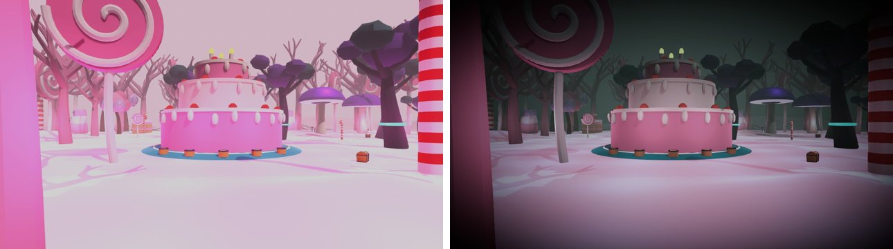
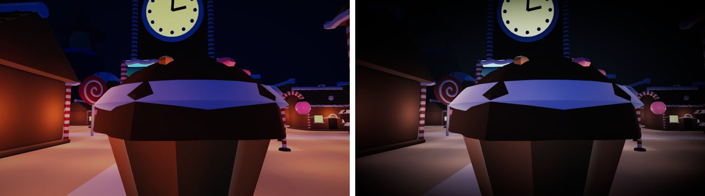
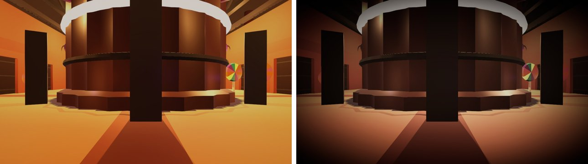
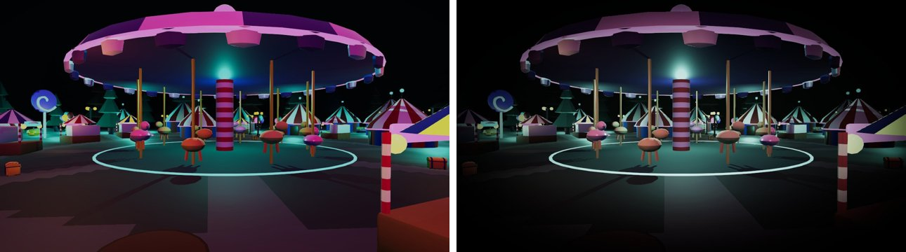
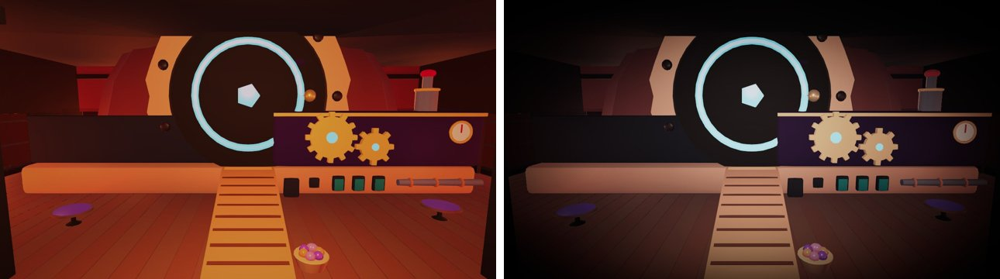
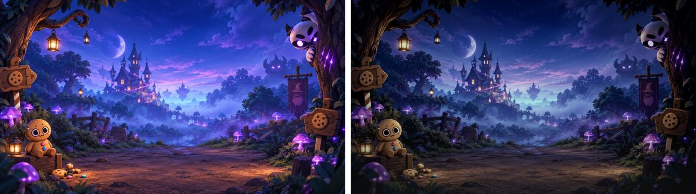

- 검증: 컴파일 오류·경고 0, Play Mode(놀이공원 오프라인)에서 깜빡이는 조명 28개가 강도를 바꾸는 것(꺼짐 0.05까지) 확인, 콘솔 오류 0.

### V2 위장 팔레트 측정 — ✅ 2026-10-07 (Q3 보류 — 측정만)
- 도구: `Tools/TagOfChaos/Maps/Measure Palette Coverage (All)` (`Assets/Editor/Maps/PaletteCoverageMeter.cs`). 맵마다 12시점(반지름 12·30·55 m)에서 찍어, 화면 픽셀을 팔레트 10색 중 가장 가까운 색상(±16°, 회색처럼 채도가 빠진 면 제외)으로 나눈다. 팔레트 기준색도 같은 색 보정을 거친 값(카메라 앞 조명 없는 색판)으로 잡는다. **큰 면적 = 화면의 1% 이상**.
- 결과(화면 %, 색 순서: 빨강·주황·노랑·연두·초록·청록·파랑·남색·보라·자주). "보정 끔"은 같은 조명·안개에서 색 보정만 끈 값.

| 맵 | 색 보정 후 | 큰 면적 색 수 | 보정 끔 큰 면적 색 수 |
|---|---|---|---|
| 캔디숲 | 0.8 0.7 0 0 0 0.5 0.6 0 0.6 **14.1** | **1** | 4 |
| 진저브레드 | **10.3 13.0** 0 0 0 0.1 0.5 **16.8 3.0** 0.8 | **4** | 5 |
| 초콜릿 공장 | **14.5 47.3 1.4** 0 0 0 0 0 0 0.5 | **3** | 2 |
| 놀이공원 | **1.6** 0.3 0.2 0.4 0.7 **9.5 1.4 3.7 3.7** 0.1 | **5** | 6 |
| 유령 베이커리 | **9.8 9.9** 0.1 0 0 0 **7.1 6.3** 0.4 0.3 | **4** | 3 |

- 해석: 색 보정을 꺼도 6색을 넘는 맵은 놀이공원뿐이다 — **원인은 색 보정이 아니라 맵 자체에 팔레트 색 면이 적은 것**(맵마다 한두 색이 압도). 그래서 팔레트 색을 바꾸는 것(Q3)은 보류를 유지하고, **V3 소품·V4 숨을 곳 가구를 각 맵에 없는 팔레트 색으로 칠해** 채운다. 노랑·연두·초록이 거의 모든 맵에서 비어 있다.
- 맵별로 채울 색(V3·V4 목표): 캔디숲 노랑·연두·초록·청록·남색 / 진저브레드 노랑·연두·초록·청록 / 공장 연두·초록·청록·파랑·보라 / 놀이공원 주황·노랑·연두 / 베이커리 노랑·연두·초록·보라.
- 재측정은 V6에서 같은 도구로 한다.

### V3 망가진 소품 — ✅ 2026-10-07
- 만드는 법(§3을 조금 바꿈): 맵 빌더(`build_<맵>.py`)를 건드리지 않고 **소품만 따로** 만든다 — `Assets/Maps/Source~/Scripts/twisted_props.py`(maplib·assets의 같은 로우폴리 도구) → FBX `Assets/09. Environment/Twisted/Models/` → 프리팹 `Assets/04. Prefabs/Twisted/`. 맵을 다시 만들어도 아래 두 메뉴만 다시 실행하면 된다(손으로 고친 좌표 없음).
  - `Tools/TagOfChaos/Maps/Build Twisted Props (Materials + Prefabs)` (`TwistedPropBuilder.cs`, 임포트 규칙 `TwistedModelImportPostprocessor.cs`): 재질 `MT_*`(팔레트 10색은 `DefaultColorPalette` 값 그대로), 충돌체 자동(메시 경계 상자, 높이 최소 2.6 m — 쿠키가 낮은 소품 위로 올라가 괴물이 못 닿는 자리가 생기지 않게).
  - `Tools/TagOfChaos/Maps/Place Twisted Props (All)` (`TwistedPropPlacer.cs`): 평평한 빈 바닥을 자동으로 찾는다 — 소품 둘레 2.5 m 안에 다른 충돌체 없음(벽과 틈 5 m 이상 → 괴물도 지나감), 탈출 장치 18 m·로켓 10 m·상자 6 m·출발점 10 m 밖, 소품끼리 11 m. 앞면이 맵 가운데를 본다. 씬 루트 `TwistedProps`.
- 소품 19종(그로테스크 기준 §1.2 — 피·내장 없음, 빈 목은 검은 속, 쿠키가 깨지면 과자 부스러기). 맵에 없는 팔레트 색(V2)으로 칠했다.

| 장면 | 소품(개수) | 채운 팔레트 색 |
|---|---|---|
| 캔디숲 | 머리 없는 유니콘(떨어진 머리) 2, 녹아내리는 눈알 막대사탕 3, 녹아내리는 사탕 나무 3, 곰팡이 핀 케이크(금·부러진 초) 2 | 노랑·연두·초록·청록·남색 |
| 진저브레드 | 팔 부서진 진저브레드 인형(떨어진 팔·부스러기) 2, 눈이 빈 진저브레드 문지기 3, 금 간 쿠키 울타리 3, 눈알 막대사탕(빨강·노랑) 2 | 노랑·연두·초록·청록 |
| 초콜릿 공장 | 녹은 인형 틀 2, 얼굴 없는 반죽 인형 컨베이어 2, 망가진 포장 기계 2, 눈알 막대사탕 1 | 연두·초록·청록·파랑·보라 |
| 놀이공원 | 머리 없는 회전목마 말 3, 찢어진 광대 간판 2, 웃음이 굳은 인형 매표소 2, 바람 빠진 풍선 3 | 주황·노랑·연두 |
| 베이커리 | 금 간 웨딩 케이크(인형 하나만 남고 하나는 떨어짐) 2, 유리병 속 떠다니는 쿠키 인형 3, 찢어진 밀가루 포대 + 밀가루 발자국 3 | 노랑·연두·초록·보라 |
| 대기실 | 매달린 젤리 곰 장식줄 2, 눈알 막대사탕(0.7배) 2, 금 간 쿠키 울타리(0.6배) 1 | — |

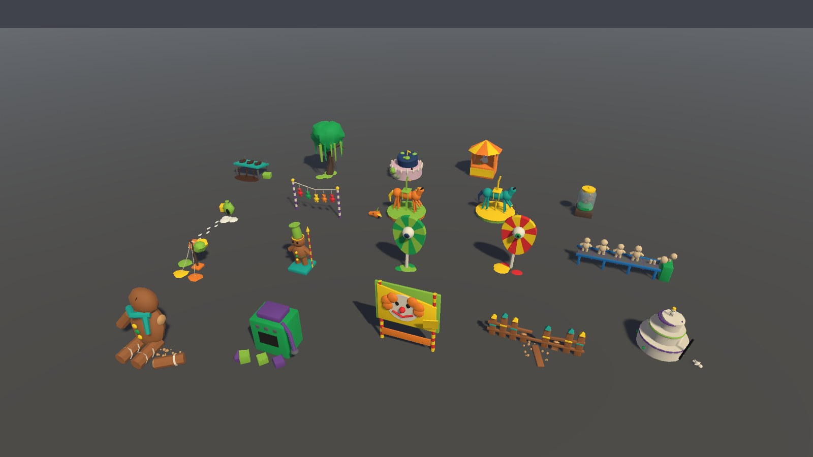
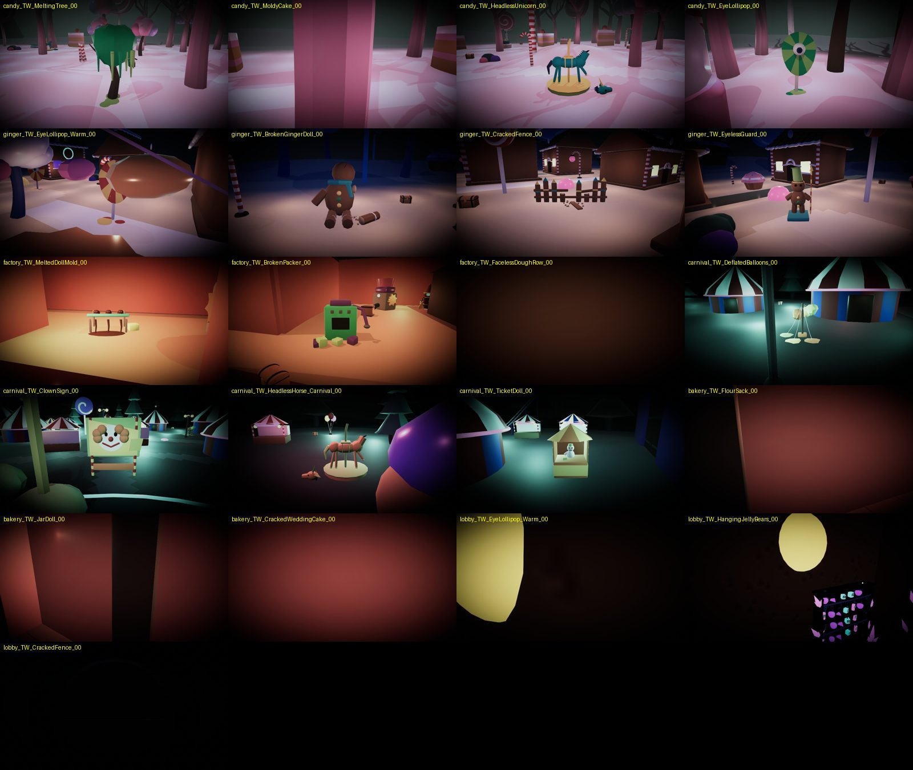
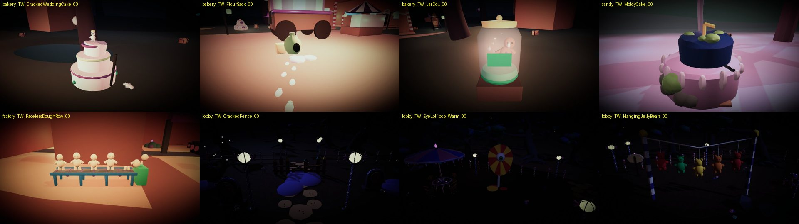

- 검증: 컴파일 오류·경고 0. `MapCompactTests` 25개 통과(처음에는 공장의 낮은 소품 위가 "쿠키만 닿는 자리"로 잡혀 실패 → 충돌체 높이 2.6 m 규칙으로 해결). Play Mode(놀이공원 오프라인): 실제 괴물·쿠키가 소품 뒤쪽 지점까지 격자 경로로 걸어가 도착(괴물 100 m, 쿠키 54 m), 콘솔 오류 0.

### V4 숨을 곳 + 실내 소리 — ✅ 2026-10-07
- 모델: `twisted_props.py`의 `TW_Shelter_CircusTent`·`TW_Shelter_GingerHouse`(V3 소품과 같은 길 — FBX → 프리팹). 보이는 메시에는 충돌체가 없고 **충돌은 `COL_*` 상자**로 정확히 만든다. Blender 표시 `Light_*` → 점광원(실내 어둑한 등 + 깜빡임, 문 위 주황 출구 등), `Zone_*` → 실내 소리 상자(`IndoorZone`).
- **놓는 자리**: 맵에 24 m 빈 땅이 없어서 **같은 크기의 장식 건물 자리를 바꾼다** — 원래 건물은 끄고(지우지 않음), 90° 단위로 돌려 보며 ①둘레 2.5 m 비어 있음 ②**문마다 바깥 6 m에서 안까지 괴물 격자 경로가 있고 건물을 돌아가지 않음**을 만족하는 첫 자리. 문 앞 7 m에는 다른 소품을 놓지 않는다.

| 숨을 곳 | 크기 | 출입구 | 안 | 놓인 자리(바꾼 건물) |
|---|---|---|---|---|
| 찢어진 서커스 텐트 | 지름 20 m, 벽 9 m, 꼭대기 15.6 m | 앞·뒤 2곳(폭 6.2 m, 높이 8 m), 찢어진 문 자락 | 문과 문 사이 시야를 끊는 남색 커튼 2장, 양쪽 벽에 팔레트 10색 상자 줄(빨강·주황·노랑 / 연두·초록·청록 + 위에 파랑·보라), 부서진 샹들리에 | 놀이공원 `CUR_CircusTent_Small_11`(−28,−54)·`_01`(33,−25) |
| 진저브레드 집 | 16×14 m, 벽 9 m + 지붕 | 앞문(폭 6 m)·뒷문(폭 6 m) + 옆 창문(폭 4 m) | 칸막이로 방 2개, 벽에 붙인 팔레트 가구(노랑 찬장·파랑 책장·청록 통·초록 침대·연두 소파·빨강 상자·주황 불씨 벽난로·보라 깔개·남색 찢어진 커튼) | 진저브레드 `GIN_GingerHouse_Cottage_28`(57,−16)·`_02`(−16,−33) |

- 첫 텐트는 가운데 기둥과 커튼 사이(2.9 m)가 괴물 몸(3.6 m)보다 좁아 안 전체가 "쿠키만 닿는 곳"으로 잡혔다 → 기둥을 매달린 샹들리에로 바꾸고 커튼을 문 쪽으로 옮겼다. 진저브레드 집 하나는 앞문이 장식 컵케이크에 막혀 문 경로 검사로 다른 자리로 옮겼다.
- **실내 소리**(§5.4): `Assets/02. Scripts/Audio/IndoorZone.cs` + `AudioRuntime` 수정. 듣는 사람과 소리가 벽을 사이에 두면(한쪽만 실내 / 서로 다른 실내) 3D 소리를 **저역 통과 700 Hz + 음량 0.55배**, 같은 실내면 풀림. 듣는 사람이 실내면 바탕 환경음도 **900 Hz + 0.5배**. 문을 지날 때 0.5초에 걸쳐 바뀐다. 실내 상자는 숨을 곳 기준 좌표라 어느 방향으로 놓아도 맞다.

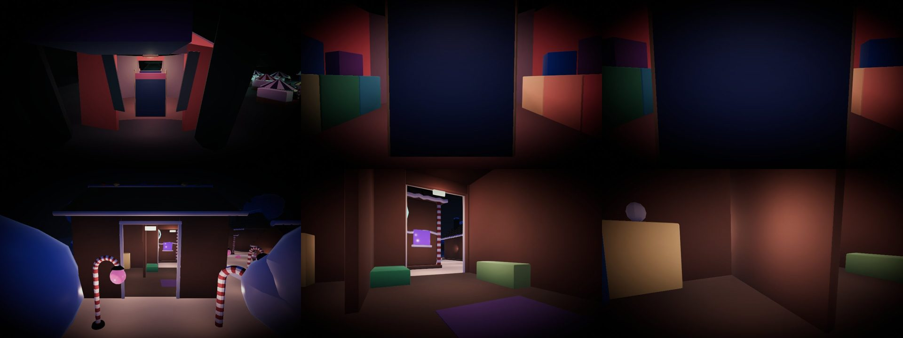

- 검증: 컴파일 오류·경고 0. `TwistedTests` 18개(분위기 값·로비 2곳·팔레트 재질·소품 충돌체 높이·맵별 소품 개수·**숨을 곳 문마다 괴물 출입**·실내 상자 범위·먹먹함 전환) + `MapCompactTests` 25개 + `AudioTests` 59개 통과.
- Play Mode(놀이공원 오프라인): 실제 괴물·쿠키가 텐트 안까지 걸어 들어감(괴물 65 m, 쿠키 38 m). 괴물(듣는 사람)이 텐트 안 → 바깥 회전목마 700 Hz·0.013, 같은 텐트 안 발소리 19 kHz(또렷), 바탕 환경음 900 Hz·0.126. 괴물이 밖으로 나오자 0.5초 뒤 회전목마 4.4 kHz·0.053(거리 기준으로 복귀), 이번엔 텐트 안 발소리가 700 Hz·0.235로 먹먹, 바탕 환경음 22 kHz·0.251. 콘솔 오류 0.

---

## 부록: 목업 만든 방법
- 분위기 전후: 맵 씬을 열어 `Main Camera` 위치를 정하고, `RenderSettings`(안개·주변광)·방향광·PostProcess 프로필 **복제본**(색 보정·비네트)을 바꿔 렌더 → 씬을 저장하지 않고 다시 연다.
- 소품: 로컬 Blender 4.5(bpy), 기본 도형 + 벗겨진 칠(잡음 텍스처) + 어두운 조명, Cycles 48샘플. 스크립트는 작업 폴더에 있다(최종 소품은 V3에서 `assets.py`로 다시 만든다).
